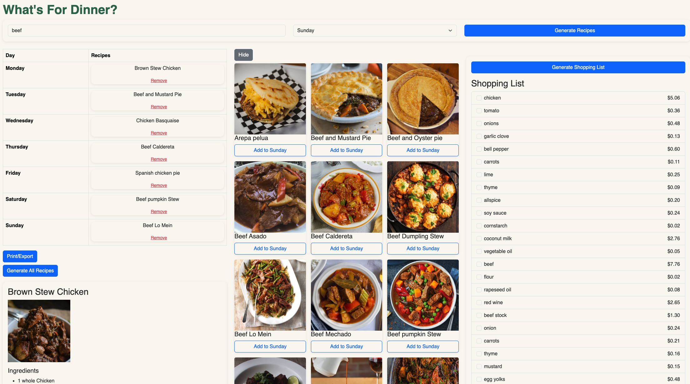
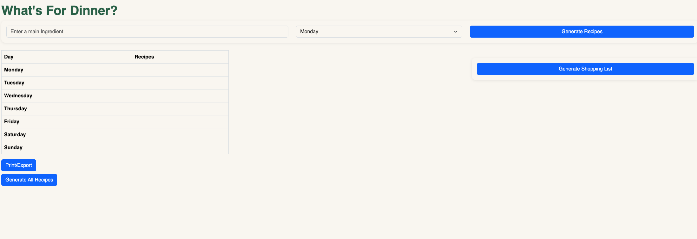
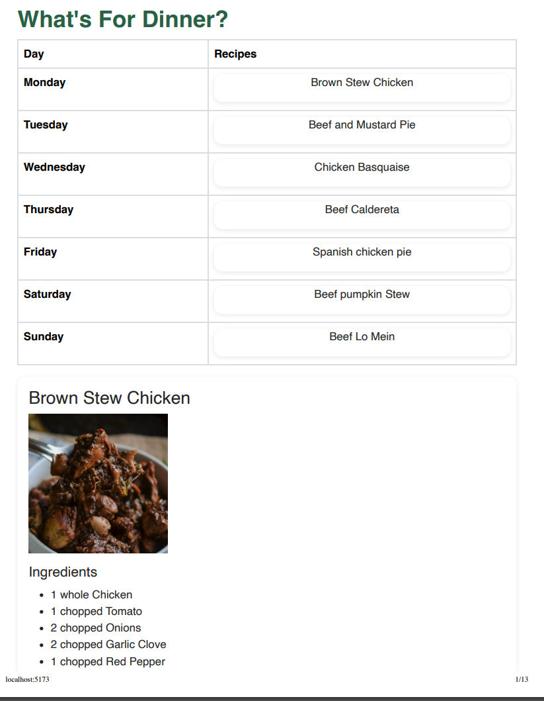

# What's For Dinner? — Weekly Meal Planner

A React meal-planning app built for a hackathon. Enter a main ingredient, browse matching recipes, add them to a 7-day plan, and generate a priced shopping list and a printable recipe book for the week.



## Features

- **Recipe search by ingredient**: finds meals that use a given main ingredient (via [TheMealDB](https://www.themealdb.com/api.php)).
- **Weekly plan**: add recipes to any day from Monday to Sunday, and remove them again.
- **Shopping list with cost estimates**: collects the ingredients from every planned meal and prices them with the Spoonacular API (via RapidAPI). Includes a running total and checkboxes to tick items off.
- **Recipe book**: fetches the full ingredients and instructions for every recipe in the plan.
- **Print / export**: a print-friendly layout that hides the controls.

## Tech Stack

| Layer    | Tools                                                       |
| -------- | ----------------------------------------------------------- |
| Frontend | React 19, Vite 8, Bootstrap 5 (CDN)                         |
| API      | Vercel serverless functions (`meal-planner/api/`)           |
| Local API (legacy) | Express 5, CORS, dotenv (`client-server/`)        |
| Data     | TheMealDB (recipes), Spoonacular via RapidAPI (pricing)     |
| Linting  | oxlint                                                      |

## Project Structure

```
Hackathon/
├── meal-planner/            # React app (deployable to Vercel)
│   ├── api/                 # Serverless API routes
│   │   ├── recipes.js       # GET  /api/recipes?ingredient=...
│   │   ├── recipe/[id].js   # GET  /api/recipe/:id
│   │   └── price.js         # POST /api/price
│   ├── components/          # SearchForm, RecipeList, WeeklyPlanTable,
│   │                        # GroceryList, RecipeBook, RecipeDetails
│   ├── src/                 # App.jsx, entry point, styles, utils.js
│   ├── recipe_db.json       # Sample TheMealDB response (reference data)
│   └── ingr_data.json       # Sample nutrition response (reference data)
└── client-server/           # Standalone Express server with the same routes
    └── server/
        ├── app.js
        └── index.js         # Listens on port 3000
```

## API Endpoints

| Method | Route                                | Description                                              |
| ------ | ------------------------------------ | -------------------------------------------------------- |
| GET    | `/api/recipes?ingredient=<name>`     | Lists meals that contain the ingredient                  |
| GET    | `/api/recipe/:id`                    | Returns full details (ingredients and instructions) for a meal |
| POST   | `/api/price`                         | Body: `{ "ingredients": ["1 cup rice", ...] }`. Returns `{ items: [{ name, costDollars }], totalCost }` |

## Getting Started

### Prerequisites

- Node.js 20+ (Vite 8 needs a recent Node release)
- A [RapidAPI](https://rapidapi.com/) key subscribed to the **Spoonacular Recipe Food Nutrition** API (only needed for shopping-list pricing)
- The [Vercel CLI](https://vercel.com/docs/cli) (`npm i -g vercel`) to run the serverless API locally

### Environment Variables

Create `meal-planner/.env` (it is gitignored):

```
RAPIDAPI_KEY=your_rapidapi_key_here
```

If you use the Express server instead, put the same variable in `client-server/server/.env`.

### Run Locally

```bash
cd meal-planner
npm install
vercel dev
```

`vercel dev` serves the React app and the `/api` routes together (by default at http://localhost:3000).

> **Note:** `npm run dev` on its own starts only the Vite frontend. The `/api` requests will fail unless something else serves them. To use the Express server in `client-server/` instead, start it with `npm start` (port 3000) and add a proxy to `meal-planner/vite.config.js`:
>
> ```js
> server: { proxy: { '/api': 'http://localhost:3000' } }
> ```

### Other Scripts (in `meal-planner/`)

| Command           | Description                         |
| ----------------- | ----------------------------------- |
| `npm run dev`     | Start the Vite dev server (frontend only) |
| `npm run build`   | Build for production into `dist/`   |
| `npm run preview` | Preview the production build        |
| `npm run lint`    | Lint with oxlint                    |

## Deployment

The `meal-planner/` folder is set up for [Vercel](https://vercel.com/ridgerunner/react100-hackathon/9JWqgHoukGtvXij9k5M6uhx6YRw4):

1. Import the repository in Vercel and set the **Root Directory** to `meal-planner`.
2. Add `RAPIDAPI_KEY` under Project Settings → Environment Variables.
3. Deploy. Vercel builds the Vite app and deploys each file in `api/` as a serverless function.

## Screenshots

**Starting screen**



**Print / export view**



## Acknowledgements

- Recipe data from [TheMealDB](https://www.themealdb.com/)
- Ingredient pricing from [Spoonacular](https://spoonacular.com/food-api)
